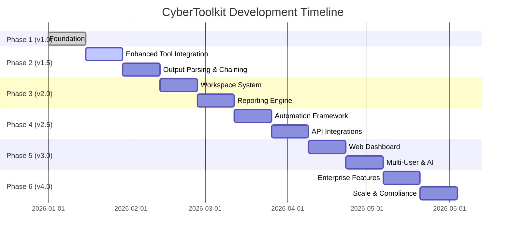
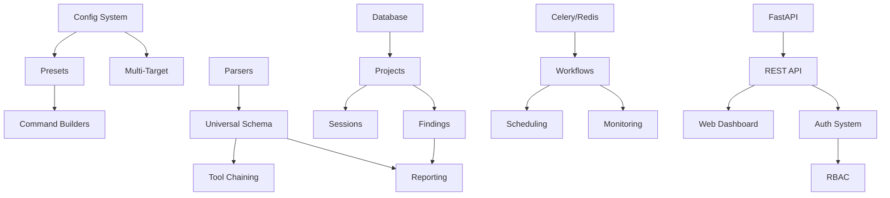
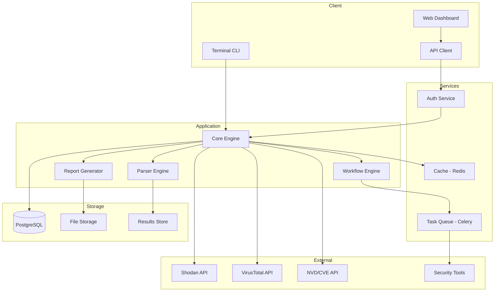
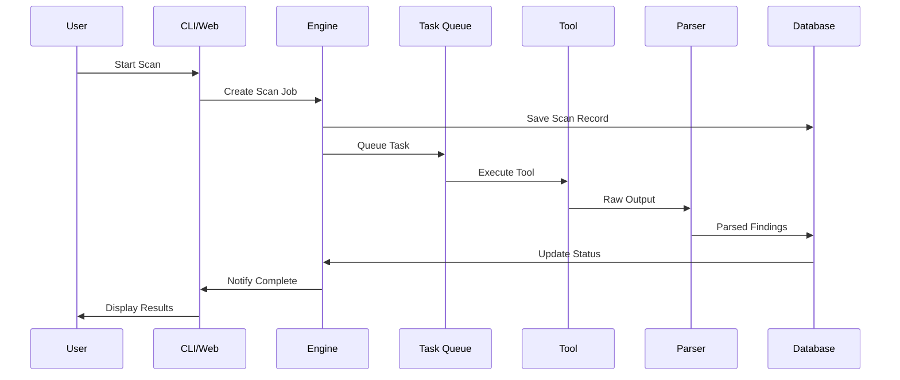

# 🛠️ CyberToolkit - Comprehensive Implementation Plan

## 📋 Table of Contents
- [Executive Summary](#executive-summary)
- [Sprint Planning](#sprint-planning)
- [Phase Breakdowns](#phase-breakdowns)
- [Dependency Mapping](#dependency-mapping)
- [Risk Analysis](#risk-analysis)
- [Technical Architecture](#technical-architecture)
- [Test Strategy](#test-strategy)
- [Deployment Strategy](#deployment-strategy)

---

## 📌 Executive Summary

| Attribute | Value |
|-----------|-------|
| **Total Phases** | 6 |
| **Total Sprints** | 12 |
| **Estimated Duration** | 24 weeks (~6 months) |
| **Total Tasks** | 125+ |
| **Priority Distribution** | P0: 20%, P1: 35%, P2: 30%, P3: 15% |

---

## 🗓️ Sprint Planning

### Sprint Overview



### Detailed Sprint Breakdown

| Sprint | Phase | Focus Area | Duration | Key Deliverables |
|--------|-------|------------|----------|------------------|
| S1 | 1.0 | Foundation | Week 1-2 | ✅ Basic UI, Tool inventory, Execution |
| S2 | 1.5 | Command Builders | Week 3-4 | Advanced flags, Presets, Profiles |
| S3 | 1.5 | Parsing & Chaining | Week 5-6 | XML/JSON parsers, Tool pipelines |
| S4 | 2.0 | Workspace | Week 7-8 | Project management, Session persistence |
| S5 | 2.0 | Reporting | Week 9-10 | HTML/PDF reports, Templates |
| S6 | 2.5 | Automation | Week 11-12 | Workflows, Conditional execution |
| S7 | 2.5 | Integrations | Week 13-14 | Shodan, VirusTotal, CVE APIs |
| S8 | 3.0 | Web UI | Week 15-16 | FastAPI backend, React frontend |
| S9 | 3.0 | Multi-User | Week 17-18 | Auth, RBAC, Shared workspaces |
| S10 | 3.0 | AI Features | Week 19-20 | Auto-triage, NLP queries |
| S11 | 4.0 | Enterprise | Week 21-22 | Asset management, SLA monitoring |
| S12 | 4.0 | Scale | Week 23-24 | Distributed scanning, Cloud deploy |

---

## 🔍 Phase Breakdowns

### Phase 1: Foundation (v1.0) ✅ COMPLETED

**Status:** ✅ Done | **Sprint:** S1 | **Duration:** 2 weeks

#### Technical Requirements
- Python 3.7+
- Rich library ≥13.0.0
- Unix-based OS (Linux/macOS)

#### Delivered Features
| Feature | Status | Acceptance Criteria |
|---------|--------|---------------------|
| Interactive Terminal UI | ✅ | Rich-based menu navigation |
| Tool Inventory (46 tools) | ✅ | 7 categories organized |
| Tool Execution | ✅ | Execute any tool with parameters |
| Result Logging | ✅ | Timestamped output files |
| Installation Checks | ✅ | Detect installed tools |

---

### Phase 2: Enhanced Tool Integration (v1.5) 🔄 IN PROGRESS

**Status:** 🔄 Active | **Sprints:** S2-S3 | **Duration:** 4 weeks

#### Sprint 2: Advanced Command Builders (Week 3-4)

##### Technical Requirements
```yaml
dependencies:
  - pyyaml>=6.0        # Config files
  - click>=8.0         # CLI framework
  - python-dotenv>=1.0 # Environment management

infrastructure:
  - config/ directory for JSON/YAML configs
  - profiles.json for scan presets
```

##### Features & Acceptance Criteria

| ID | Feature | Priority | Est. Hours | Acceptance Criteria |
|----|---------|----------|------------|---------------------|
| P2-01 | Nmap Preset Profiles | P0 | 8h | 5+ presets: quick, full, stealth, vuln, custom |
| P2-02 | Nuclei Template Mgmt | P0 | 12h | Browse, filter, import custom templates |
| P2-03 | Interactive Flag Builder | P1 | 16h | Visual flag selection for top 10 tools |
| P2-04 | Wordlist Manager | P1 | 8h | SecLists integration, custom generator |
| P2-05 | Config File System | P0 | 6h | JSON/YAML config read/write |
| P2-06 | Multi-Target Input | P1 | 6h | File input, CIDR notation support |

##### Scan Preset Specifications

```python
NMAP_PRESETS = {
    "quick": {
        "flags": "-sV -T4 -F",
        "description": "Fast service detection (top 100 ports)",
        "estimated_time": "< 2 min"
    },
    "full": {
        "flags": "-sS -sV -O -p- -T4 -A",
        "description": "Comprehensive scan all ports",
        "estimated_time": "15-30 min"
    },
    "stealth": {
        "flags": "-sS -T2 -f --data-length 25",
        "description": "Low-profile evasion scan",
        "estimated_time": "10-20 min"
    },
    "vuln": {
        "flags": "-sV --script vuln,exploit,auth",
        "description": "Vulnerability detection",
        "estimated_time": "20-45 min"
    },
    "udp": {
        "flags": "-sU -sV --top-ports 100",
        "description": "UDP service scan",
        "estimated_time": "10-30 min"
    }
}
```

---

#### Sprint 3: Output Parsing & Tool Chaining (Week 5-6)

##### Features & Acceptance Criteria

| ID | Feature | Priority | Est. Hours | Acceptance Criteria |
|----|---------|----------|------------|---------------------|
| P2-07 | Nmap XML Parser | P0 | 10h | Extract hosts, ports, services, OS info |
| P2-08 | Nuclei JSON Parser | P0 | 8h | Extract vulns, severity, templates |
| P2-09 | Ffuf Parser | P1 | 6h | Extract discovered paths, status codes |
| P2-10 | Universal JSON Output | P0 | 8h | Standardized schema for all parsers |
| P2-11 | Tool Chaining Engine | P0 | 20h | Pipe output between tools |
| P2-12 | Visual Workflow Builder | P2 | 16h | ASCII-based workflow diagram |
| P2-13 | Error Handling Improvements | P1 | 8h | Graceful failures, retry logic |
| P2-14 | Logging System | P1 | 6h | File + console, log levels |

##### Parser Output Schema

```python
# Universal scan result schema
class ScanResult:
    tool: str          # "nmap", "nuclei", etc.
    timestamp: str     # ISO 8601
    target: str        # IP/domain
    status: str        # "success", "partial", "failed"
    findings: List[Finding]
    metadata: dict

class Finding:
    type: str          # "port", "vuln", "path", etc.
    severity: str      # "critical", "high", "medium", "low", "info"
    title: str
    description: str
    evidence: str
    remediation: str   # Optional
```

##### Tool Chain Examples

```python
# Example workflow: Web reconnaissance
RECON_WORKFLOW = {
    "name": "Web Application Recon",
    "steps": [
        {
            "tool": "subfinder",
            "input": "${TARGET}",
            "output": "subdomains.txt"
        },
        {
            "tool": "httpx",
            "input": "subdomains.txt",
            "flags": "-sc -cl -title",
            "output": "live_hosts.txt"
        },
        {
            "tool": "nuclei",
            "input": "live_hosts.txt",
            "flags": "-severity critical,high",
            "output": "vulnerabilities.json"
        }
    ]
}
```

---

### Phase 3: Workspace & Project Management (v2.0) 📋 PLANNED

**Status:** Planned | **Sprints:** S4-S5 | **Duration:** 4 weeks

#### Sprint 4: Workspace System (Week 7-8)

##### Technical Requirements
```yaml
dependencies:
  - sqlalchemy>=2.0    # Database ORM
  - pydantic>=2.0      # Data validation

infrastructure:
  - SQLite database (workspace.db)
  - workspace/ directory structure
```

##### Features & Acceptance Criteria

| ID | Feature | Priority | Est. Hours | Acceptance Criteria |
|----|---------|----------|------------|---------------------|
| P3-01 | Project CRUD | P0 | 12h | Create, read, update, delete projects |
| P3-02 | Project Configuration | P0 | 8h | Per-project settings, scopes |
| P3-03 | Session Persistence | P0 | 10h | Save/restore session state |
| P3-04 | Organized Results | P1 | 8h | Project-based directory structure |
| P3-05 | Target Profiles | P1 | 10h | Reusable target definitions |
| P3-06 | Scope Management | P1 | 8h | In-scope/out-of-scope lists |
| P3-07 | Asset Inventory | P2 | 12h | Track discovered assets |
| P3-08 | Exclusion Lists | P2 | 6h | Global and per-project exclusions |

##### Workspace Database Schema

```sql
-- Projects table
CREATE TABLE projects (
    id INTEGER PRIMARY KEY,
    name TEXT NOT NULL UNIQUE,
    description TEXT,
    scope_type TEXT,  -- 'domain', 'ip_range', 'mixed'
    created_at TIMESTAMP DEFAULT CURRENT_TIMESTAMP,
    updated_at TIMESTAMP DEFAULT CURRENT_TIMESTAMP
);

-- Targets table
CREATE TABLE targets (
    id INTEGER PRIMARY KEY,
    project_id INTEGER REFERENCES projects(id),
    value TEXT NOT NULL,  -- IP, domain, CIDR
    type TEXT NOT NULL,   -- 'ip', 'domain', 'cidr'
    status TEXT DEFAULT 'pending',
    tags TEXT,  -- JSON array
    notes TEXT,
    created_at TIMESTAMP DEFAULT CURRENT_TIMESTAMP
);

-- Scans table
CREATE TABLE scans (
    id INTEGER PRIMARY KEY,
    project_id INTEGER REFERENCES projects(id),
    tool TEXT NOT NULL,
    target_id INTEGER REFERENCES targets(id),
    command TEXT NOT NULL,
    status TEXT DEFAULT 'pending',
    started_at TIMESTAMP,
    completed_at TIMESTAMP,
    result_path TEXT
);

-- Findings table
CREATE TABLE findings (
    id INTEGER PRIMARY KEY,
    scan_id INTEGER REFERENCES scans(id),
    type TEXT NOT NULL,
    severity TEXT NOT NULL,
    title TEXT NOT NULL,
    description TEXT,
    evidence TEXT,
    status TEXT DEFAULT 'open',  -- 'open', 'confirmed', 'false_positive', 'fixed'
    created_at TIMESTAMP DEFAULT CURRENT_TIMESTAMP
);
```

---

#### Sprint 5: Reporting Engine (Week 9-10)

##### Features & Acceptance Criteria

| ID | Feature | Priority | Est. Hours | Acceptance Criteria |
|----|---------|----------|------------|---------------------|
| P3-09 | HTML Report Generator | P0 | 16h | Professional styled report |
| P3-10 | PDF Export | P0 | 12h | Print-ready PDF generation |
| P3-11 | Report Templates | P1 | 10h | 3+ templates: executive, technical, full |
| P3-12 | Executive Summary | P1 | 8h | Auto-generated summary |
| P3-13 | Integrated Notes | P2 | 10h | Markdown note-taking |
| P3-14 | Screenshot Management | P2 | 8h | Attach evidence screenshots |
| P3-15 | Finding Tags | P2 | 6h | Categorize findings |
| P3-16 | Evidence Timeline | P3 | 10h | Chronological evidence view |

##### Report Template Structure

```html
<!-- Executive Report Template -->
<report>
  <header>
    <title>Security Assessment Report</title>
    <client>{{ project.name }}</client>
    <date>{{ report.date }}</date>
    <assessor>{{ config.assessor_name }}</assessor>
  </header>
  
  <executive_summary>
    <overview>{{ summary.overview }}</overview>
    <risk_rating>{{ summary.risk_rating }}</risk_rating>
    <key_findings>{{ summary.top_findings | limit(5) }}</key_findings>
    <recommendations>{{ summary.recommendations }}</recommendations>
  </executive_summary>
  
  <statistics>
    <finding_distribution>{{ charts.severity_pie }}</finding_distribution>
    <scan_coverage>{{ charts.coverage_bar }}</scan_coverage>
  </statistics>
  
  <findings>
    
    <finding severity="{{ finding.severity }}">
      <title>{{ finding.title }}</title>
      <description>{{ finding.description }}</description>
      <evidence>{{ finding.evidence }}</evidence>
      <remediation>{{ finding.remediation }}</remediation>
    </finding>
    
  </findings>
</report>
```

---

### Phase 4: Automation & Intelligence (v2.5) 📋 PLANNED

**Status:** Planned | **Sprints:** S6-S7 | **Duration:** 4 weeks

#### Sprint 6: Automation Framework (Week 11-12)

##### Technical Requirements
```yaml
dependencies:
  - celery>=5.3.0      # Async task queue
  - redis>=5.0.0       # Message broker
  - schedule>=1.2.0    # Task scheduling

infrastructure:
  - Redis server for task queue
  - templates/workflows/ directory
```

##### Features & Acceptance Criteria

| ID | Feature | Priority | Est. Hours | Acceptance Criteria |
|----|---------|----------|------------|---------------------|
| P4-01 | Workflow Engine | P0 | 20h | Execute multi-step workflows |
| P4-02 | Pre-defined Workflows | P0 | 12h | 5+ common pentest workflows |
| P4-03 | Conditional Execution | P1 | 14h | If-then logic in workflows |
| P4-04 | Scheduled Scans | P1 | 10h | Cron-style scan scheduling |
| P4-05 | Continuous Monitoring | P2 | 12h | Background change detection |
| P4-06 | Parallel Execution | P1 | 10h | Run multiple tools simultaneously |
| P4-07 | Progress Tracking | P2 | 8h | Real-time workflow progress |

##### Pre-defined Workflows

```yaml
# workflows/web_pentest_full.yaml
name: "Full Web Application Pentest"
description: "Comprehensive web application security assessment"
estimated_time: "2-4 hours"
steps:
  - name: "Subdomain Enumeration"
    tools: [subfinder, amass, dnsx]
    parallel: true
    output: subdomains.txt

  - name: "HTTP Probing"
    tool: httpx
    input: subdomains.txt
    flags: "-sc -cl -title -tech-detect"
    output: live_hosts.json

  - name: "Port Scanning"
    tool: nmap
    input: live_hosts.json
    preset: "full"
    output: ports.xml
    condition: "live_hosts.count > 0"

  - name: "Directory Fuzzing"
    tool: ffuf
    input: live_hosts.json
    wordlist: "common.txt"
    parallel: true
    max_parallel: 5
    output: directories/

  - name: "Vulnerability Scanning"
    tool: nuclei
    input: live_hosts.json
    flags: "-severity critical,high,medium"
    output: vulnerabilities.json

  - name: "Technology-Specific Scans"
    conditions:
      - if: "tech contains 'WordPress'"
        tool: wpscan
        flags: "--enumerate ap,at,u"
      - if: "tech contains 'Joomla'"
        tool: joomscan
      - if: "tech contains 'Drupal'"
        tool: droopescan

  - name: "SQL Injection Testing"
    tool: sqlmap
    input: "directories/*.txt"
    flags: "--batch --forms --crawl=2"
    condition: "directories.count > 0"
```

---

#### Sprint 7: API Integrations (Week 13-14)

##### Features & Acceptance Criteria

| ID | Feature | Priority | Est. Hours | Acceptance Criteria |
|----|---------|----------|------------|---------------------|
| P4-08 | Shodan Integration | P1 | 10h | Search, host info, vuln data |
| P4-09 | VirusTotal Integration | P1 | 8h | File/URL/IP reputation check |
| P4-10 | CVE Database Lookup | P0 | 8h | NVD/MITRE CVE search |
| P4-11 | Exploit-DB Integration | P1 | 8h | Searchsploit API wrapper |
| P4-12 | Smart Recommendations | P1 | 16h | Suggest next tools/actions |
| P4-13 | Vulnerability Correlation | P2 | 12h | Cross-reference findings |
| P4-14 | Risk Scoring Engine | P2 | 10h | CVSS-based risk calculation |
| P4-15 | Plugin System | P2 | 16h | Custom tool integration API |

##### API Integration Schema

```python
# integrations/shodan.py
class ShodanIntegration:
    def __init__(self, api_key: str):
        self.api = shodan.Shodan(api_key)
    
    def host_info(self, ip: str) -> dict:
        """Get comprehensive host information"""
        return {
            "ip": ip,
            "hostnames": [...],
            "ports": [...],
            "vulns": [...],
            "asn": "...",
            "org": "...",
            "country": "..."
        }
    
    def search(self, query: str, limit: int = 100) -> List[dict]:
        """Search Shodan for hosts"""
        ...
    
    def exploits(self, cve: str) -> List[dict]:
        """Find exploits for a CVE"""
        ...

# integrations/cve.py
class CVELookup:
    NVD_API = "https://services.nvd.nist.gov/rest/json/cves/2.0"
    
    def get_cve(self, cve_id: str) -> dict:
        """Get CVE details from NVD"""
        return {
            "id": cve_id,
            "description": "...",
            "cvss_v3": 9.8,
            "severity": "CRITICAL",
            "affected_products": [...],
            "references": [...],
            "exploits_available": True
        }
```

---

### Phase 5: Collaboration & Advanced Features (v3.0) 📋 FUTURE

**Status:** Future | **Sprints:** S8-S10 | **Duration:** 6 weeks

#### Sprint 8: Web Dashboard (Week 15-16)

##### Technical Requirements
```yaml
backend:
  - fastapi>=0.100.0   # REST API
  - uvicorn>=0.23.0    # ASGI server
  - python-jose>=3.3   # JWT tokens
  - passlib>=1.7       # Password hashing

frontend:
  - React 18+
  - TailwindCSS
  - Chart.js for visualizations
  - Zustand for state management

infrastructure:
  - PostgreSQL database
  - Redis for caching/sessions
  - Docker containerization
```

##### API Endpoints

```yaml
# /api/v1/ routes
auth:
  POST /auth/login          # User login
  POST /auth/logout         # User logout
  POST /auth/refresh        # Refresh token
  GET  /auth/me             # Current user

projects:
  GET    /projects          # List projects
  POST   /projects          # Create project
  GET    /projects/{id}     # Get project
  PUT    /projects/{id}     # Update project
  DELETE /projects/{id}     # Delete project

scans:
  GET  /projects/{id}/scans      # List scans
  POST /projects/{id}/scans      # Start scan
  GET  /scans/{id}               # Scan details
  GET  /scans/{id}/status        # Scan status
  POST /scans/{id}/stop          # Stop scan

findings:
  GET  /projects/{id}/findings        # List findings
  GET  /findings/{id}                 # Finding details
  PUT  /findings/{id}/status          # Update status
  POST /findings/{id}/notes           # Add notes

reports:
  GET  /projects/{id}/reports         # List reports
  POST /projects/{id}/reports         # Generate report
  GET  /reports/{id}/download         # Download report
```

#### Sprint 9: Multi-User Support (Week 17-18)

##### Features & Acceptance Criteria

| ID | Feature | Priority | Est. Hours | Acceptance Criteria |
|----|---------|----------|------------|---------------------|
| P5-01 | User Authentication | P0 | 16h | JWT-based auth, secure sessions |
| P5-02 | Role-Based Access | P0 | 12h | Admin, Lead, Analyst, Viewer roles |
| P5-03 | Team Management | P1 | 10h | Create teams, assign members |
| P5-04 | Shared Workspaces | P1 | 14h | Collaborative project access |
| P5-05 | Activity Logging | P0 | 8h | Audit trail for all actions |
| P5-06 | Permission Matrix | P1 | 10h | Granular permission control |

##### RBAC Permission Matrix

| Action | Admin | Lead | Analyst | Viewer |
|--------|-------|------|---------|--------|
| Create Project | ✅ | ✅ | ❌ | ❌ |
| Delete Project | ✅ | ❌ | ❌ | ❌ |
| Start Scans | ✅ | ✅ | ✅ | ❌ |
| View Results | ✅ | ✅ | ✅ | ✅ |
| Edit Findings | ✅ | ✅ | ✅ | ❌ |
| Generate Reports | ✅ | ✅ | ✅ | ❌ |
| Manage Users | ✅ | ❌ | ❌ | ❌ |
| View Audit Logs | ✅ | ✅ | ❌ | ❌ |

#### Sprint 10: AI-Powered Features (Week 19-20)

##### Features & Acceptance Criteria

| ID | Feature | Priority | Est. Hours | Acceptance Criteria |
|----|---------|----------|------------|---------------------|
| P5-07 | Auto-Triage Findings | P2 | 20h | ML-based severity assessment |
| P5-08 | Natural Language Queries | P2 | 16h | "Show critical vulns from last week" |
| P5-09 | Report Generation | P1 | 14h | AI-written executive summaries |
| P5-10 | Attack Path Analysis | P2 | 20h | Visualize exploitation chains |
| P5-11 | Vulnerability Prediction | P3 | 24h | Predict likely vulns based on stack |

---

### Phase 6: Enterprise & Scale (v4.0) 📋 VISION

**Status:** Vision | **Sprints:** S11-S12 | **Duration:** 4 weeks

#### Enterprise Features

| ID | Feature | Priority | Est. Hours | Description |
|----|---------|----------|------------|-------------|
| P6-01 | Asset Management | P1 | 40h | Full CMDB integration |
| P6-02 | Vulnerability Database | P1 | 32h | Internal vuln tracking |
| P6-03 | Patch Tracking | P2 | 24h | Remediation workflows |
| P6-04 | SLA Monitoring | P2 | 20h | Compliance deadlines |
| P6-05 | Distributed Scanning | P1 | 40h | Multi-node scanning |
| P6-06 | Cloud Integration | P2 | 32h | AWS/Azure/GCP APIs |
| P6-07 | Compliance Reports | P1 | 24h | OWASP, NIST, PCI-DSS |
| P6-08 | Audit Logging | P0 | 16h | Comprehensive audit trail |

---

## 🔗 Dependency Mapping

### Phase Dependencies

```mermaid
graph LR
    subgraph Phase1[Phase 1: Foundation]
        P1[v1.0]
    end
    
    subgraph Phase2[Phase 2: Tool Integration]
        P2A[Command Builders]
        P2B[Parsing]
        P2C[Chaining]
    end
    
    subgraph Phase3[Phase 3: Workspace]
        P3A[Projects]
        P3B[Reporting]
    end
    
    subgraph Phase4[Phase 4: Automation]
        P4A[Workflows]
        P4B[Integrations]
    end
    
    subgraph Phase5[Phase 5: Collaboration]
        P5A[Web Dashboard]
        P5B[Multi-User]
        P5C[AI Features]
    end
    
    subgraph Phase6[Phase 6: Enterprise]
        P6[Enterprise]
    end
    
    P1 --> P2A
    P2A --> P2B
    P2B --> P2C
    P2C --> P3A
    P3A --> P3B
    P3B --> P4A
    P4A --> P4B
    P4B --> P5A
    P5A --> P5B
    P5B --> P5C
    P5C --> P6
```



### Feature Dependencies



---

## ⚠️ Risk Analysis

### Risk Matrix

| Risk ID | Description | Probability | Impact | Mitigation |
|---------|-------------|-------------|--------|------------|
| R1 | Tool compatibility issues across OS | Medium | High | Extensive testing on Kali, Ubuntu, Parrot |
| R2 | Parser breakage on tool version updates | High | Medium | Version detection, fallback parsers |
| R3 | Performance degradation with large results | Medium | High | Pagination, lazy loading, indexing |
| R4 | API rate limiting from external services | High | Low | Caching, request queuing, fallback data |
| R5 | Security vulnerabilities in web dashboard | Medium | Critical | Security audit, OWASP compliance, pen test |
| R6 | Database corruption/data loss | Low | Critical | Automated backups, transaction logging |
| R7 | Redis/Celery queue failures | Medium | Medium | Health checks, auto-restart, fallback modes |
| R8 | Scope creep in AI features | High | Medium | Strict MVP definition, phased rollout |

### Technical Debt Tracking

| Area | Current Debt | Priority to Address | Sprint Target |
|------|--------------|---------------------|---------------|
| Monolithic architecture | High | P0 | S2 |
| No automated tests | High | P0 | S2-S3 |
| Hardcoded configurations | Medium | P1 | S2 |
| Error handling gaps | Medium | P1 | S3 |
| No logging system | Medium | P1 | S3 |
| No input validation | High | P0 | S2 |

---

## 🏗️ Technical Architecture

### System Architecture (v2.0+)



### Data Flow



---

## 🧪 Test Strategy

### Testing Pyramid

| Level | Coverage Target | Tools | Automation |
|-------|----------------|-------|------------|
| Unit Tests | 80% | pytest, unittest | CI/CD |
| Integration Tests | 60% | pytest, Docker | CI/CD |
| E2E Tests | 40% | Playwright, Selenium | Nightly |
| Security Tests | 100% (critical paths) | bandit, safety | CI/CD |
| Performance Tests | Key workflows | locust | Weekly |

### Test Categories

```python
# tests/unit/test_parsers.py
class TestNmapParser:
    def test_parse_xml_valid(self): ...
    def test_parse_xml_empty(self): ...
    def test_extract_open_ports(self): ...
    def test_extract_services(self): ...

# tests/integration/test_workflows.py
class TestWorkflowExecution:
    def test_sequential_workflow(self): ...
    def test_parallel_workflow(self): ...
    def test_conditional_workflow(self): ...
    def test_workflow_failure_handling(self): ...

# tests/e2e/test_full_scan.py
class TestFullScanFlow:
    def test_create_project_and_scan(self): ...
    def test_view_results(self): ...
    def test_generate_report(self): ...
```

---

## 🚀 Deployment Strategy

### Deployment Environments

| Environment | Purpose | Infrastructure |
|-------------|---------|----------------|
| Development | Local testing | Docker Compose |
| Staging | Integration testing | Single VPS |
| Production | Live usage | K8s cluster / Cloud |

### Docker Compose (Development)

```yaml
version: '3.8'
services:
  cybertoolkit:
    build: .
    volumes:
      - ./results:/app/results
      - ./workspace:/app/workspace
    environment:
      - DATABASE_URL=postgresql://user:pass@db/toolkit
      - REDIS_URL=redis://redis:6379
    depends_on:
      - db
      - redis

  db:
    image: postgres:15
    volumes:
      - postgres_data:/var/lib/postgresql/data
    environment:
      - POSTGRES_USER=user
      - POSTGRES_PASSWORD=pass
      - POSTGRES_DB=toolkit

  redis:
    image: redis:7-alpine
    volumes:
      - redis_data:/data

  worker:
    build: .
    command: celery -A core.tasks worker -l info
    depends_on:
      - redis
      - db

volumes:
  postgres_data:
  redis_data:
```

---

## 📊 Success Metrics

### KPIs per Phase

| Phase | Metric | Target |
|-------|--------|--------|
| v1.5 | Tools with advanced presets | 15+ |
| v1.5 | Parser coverage | 10+ tools |
| v2.0 | Active projects created | 50+ |
| v2.0 | Reports generated | 100+ |
| v2.5 | Workflows executed | 500+ |
| v2.5 | API integration usage | 1000+ calls |
| v3.0 | Registered users | 500+ |
| v3.0 | Daily active users | 50+ |
| v4.0 | Enterprise clients | 10+ |

---

**Document Version:** 1.0  
**Last Updated:** January 2026  
**Status:** Active Development
