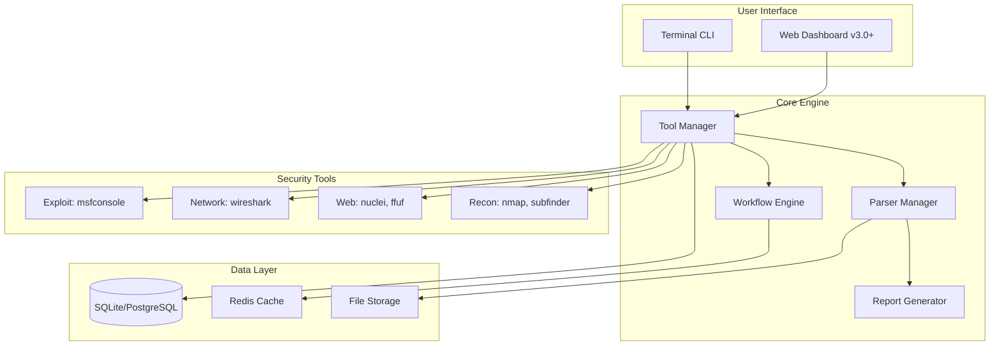

# 🛡️ CyberToolkit - Complete Project Roadmap

> **A unified, terminal-based interface for penetration testing and security assessment tools.**

[](#current-version-v10)
[](#technical-stack)
[](#license)
[](#development-phases)

## 📚 Documentation Suite

| Document | Description | Status |
|----------|-------------|--------|
| 📖 [README.md](README.md) | Project overview & quick start | ✅ Current |
| 🗺️ [IMPLEMENTATION_PLAN.md](IMPLEMENTATION_PLAN.md) | Sprint planning, architecture, risk analysis | ✅ Complete |
| 📋 [TASKS.md](TASKS.md) | 137 granular tasks with tracking | ✅ Complete |

## 📋 Table of Contents
- [Project Overview](#project-overview)
- [Quick Start](#quick-start)
- [Current Version (v1.0)](#current-version-v10)
- [Architecture](#architecture)
- [Development Phases](#development-phases)
- [Feature Roadmap](#feature-roadmap)
- [Technical Stack](#technical-stack)
- [Installation Guide](#installation-guide)
- [Complete Source Code](#complete-source-code)
- [Contributing](#contributing)
- [Future Vision](#future-vision)

## 🎯 Project Overview

CyberToolkit is a unified, terminal-based interface for managing and executing penetration testing and security assessment tools. It aims to simplify the workflow of mid-to-advanced level security professionals by providing a single, intuitive interface for dozens of specialized tools.

### 📊 Key Metrics

| Metric | Value |
|--------|-------|
| **Total Tools** | 46 |
| **Categories** | 7 |
| **Phases Planned** | 6 |
| **Total Tasks** | 137 |
| **Est. Completion** | 24 weeks |

### Mission Statement
To create the most comprehensive, user-friendly, and efficient terminal-based security toolkit that empowers security professionals to focus on analysis rather than tool management.

### Target Audience
- Mid to Senior level penetration testers
- Security researchers
- Red team operators
- Bug bounty hunters
- Security enthusiasts

## ⚡ Quick Start

```bash
# 1. Clone repository
git clone https://github.com/yourusername/CyberToolkit.git
cd CyberToolkit

# 2. Install dependencies
pip3 install -r requirements.txt

# 3. Run (with sudo for privileged tools)
sudo python3 cyber_toolkit.py
```

### First Run Checklist
- [ ] Check installed tools: `Settings → Check System Dependencies`
- [ ] Set default target: `Settings → Configure Target`
- [ ] Update Nuclei templates: `nuclei -update-templates`

## 🚀 Current Version (v1.0)

### ✅ Implemented Features

**Core Functionality:**
- ✅ Interactive terminal UI with Rich library
- ✅ 7 major tool categories (40+ tools)
- ✅ Tool installation status checking
- ✅ Target management system
- ✅ Automated result logging with timestamps
- ✅ Basic tool execution framework
- ✅ Settings and configuration menu

**Tool Categories:**
1. **Reconnaissance & OSINT** (8 tools): nmap, masscan, rustscan, subfinder, amass, dnsx, theHarvester, sherlock
2. **Web Application Testing** (8 tools): ffuf, nuclei, sqlmap, wfuzz, httpx, gobuster, nikto, wpscan
3. **Network Analysis** (6 tools): wireshark, tshark, tcpdump, netcat, ncat, bettercap
4. **Exploitation & Post-Exploitation** (6 tools): msfconsole, crackmapexec, evil-winrm, impacket, linpeas, winpeas
5. **Password & Hash Attacks** (6 tools): hashcat, john, hydra, medusa, crunch, cewl
6. **Wireless Testing** (6 tools): aircrack-ng suite, reaver, bully, wifite
7. **Utilities** (6 tools): searchsploit, git, curl, wget, jq, base64

### 📊 Statistics
- **Total Tools:** 46
- **Categories:** 7
- **Lines of Code:** ~800
- **Dependencies:** Python 3.7+, Rich library

## 🏗️ Architecture

### System Architecture Diagram



### Current Structure (v1.0)
```
CyberToolkit/
├── cyber_toolkit.py          # Main application
├── results/                  # Auto-generated results directory
│   └── tool_timestamp.txt    # Individual tool outputs
├── README.md                 # User documentation
├── IMPLEMENTATION_PLAN.md    # Sprint planning & architecture
├── TASKS.md                  # 137 granular tasks
└── requirements.txt          # Python dependencies
```

### Planned Structure (v2.0+)
```
CyberToolkit/
├── main.py                  # Entry point
├── core/
│   ├── __init__.py
│   ├── toolkit.py          # Main toolkit class
│   ├── tool_manager.py     # Tool execution & management
│   ├── config.py           # Configuration handler
│   └── utils.py            # Utility functions
├── modules/
│   ├── __init__.py
│   ├── recon.py            # Reconnaissance module
│   ├── web.py              # Web testing module
│   ├── network.py          # Network analysis module
│   ├── exploitation.py     # Exploitation module
│   ├── password.py         # Password cracking module
│   ├── wireless.py         # Wireless testing module
│   └── utilities.py        # Utilities module
├── parsers/
│   ├── __init__.py
│   ├── nmap_parser.py      # Parse nmap XML output
│   ├── nuclei_parser.py    # Parse nuclei JSON
│   └── ...                 # Tool-specific parsers
├── templates/
│   ├── commands/           # Command templates
│   ├── reports/            # Report templates
│   └── workflows/          # Automated workflows
├── plugins/                # Custom plugin system
├── workspace/              # Project workspaces
│   └── project_name/
│       ├── config.json
│       ├── targets.txt
│       ├── notes.md
│       └── results/
├── wordlists/              # Custom wordlists
├── config/
│   ├── settings.json       # Global settings
│   ├── tools.json          # Tool configurations
│   └── profiles.json       # Scan profiles
├── web/                    # Web dashboard (future)
│   ├── app.py
│   ├── static/
│   └── templates/
├── tests/                  # Unit tests
├── docs/                   # Documentation
├── requirements.txt
├── setup.py
└── README.md
```

## 📅 Development Phases

> **📋 Detailed task breakdown:** See [TASKS.md](TASKS.md) for 137 granular tasks  
> **🗺️ Sprint planning:** See [IMPLEMENTATION_PLAN.md](IMPLEMENTATION_PLAN.md) for timelines & risks

### Progress Overview

| Phase | Version | Status | Tasks | Progress |
|-------|---------|--------|-------|----------|
| Foundation | v1.0 | ✅ Done | 5/5 | ████████████ 100% |
| Tool Integration | v1.5 | 🔄 Active | 0/36 | ░░░░░░░░░░░░ 0% |
| Workspace | v2.0 | ⏳ Planned | 0/32 | ░░░░░░░░░░░░ 0% |
| Automation | v2.5 | ⏳ Planned | 0/16 | ░░░░░░░░░░░░ 0% |
| Collaboration | v3.0 | 🔮 Future | 0/28 | ░░░░░░░░░░░░ 0% |
| Enterprise | v4.0 | 🔮 Vision | 0/20 | ░░░░░░░░░░░░ 0% |

---

### Phase 1: Foundation (v1.0) ✅ COMPLETED
**Sprint:** S1 | **Duration:** 2 weeks | **Tasks:** 5 | **Status:** ✅ Complete

| Task | Status |
|------|--------|
| Basic UI framework | ✅ |
| Tool inventory (46 tools) | ✅ |
| Tool execution | ✅ |
| Result logging | ✅ |
| Installation checks | ✅ |

### Phase 2: Enhanced Tool Integration (v1.5) 🔄 IN PROGRESS
**Timeline:** Week 3-4 | **Status:** 🔄 Current Phase

**Priority Features:**
- [ ] **Advanced Command Builders**
  - Custom flags for each major tool
  - Preset profiles (quick, full, stealth, etc.)
  - Interactive parameter selection

- [ ] **Output Parsing**
  - Parse nmap XML → structured data
  - Parse nuclei JSON → vulnerability list
  - Parse ffuf → discovered paths
  - Universal JSON output format

- [ ] **Tool Chaining**
  - Pipe output from one tool to another
  - Example: subfinder → httpx → nuclei
  - Visual workflow builder

- [ ] **Multi-Target Support**
  - Read targets from file
  - CIDR notation support
  - Target list management

**Technical Improvements:**
- [ ] Modular architecture refactoring
- [ ] Config file system (JSON/YAML)
- [ ] Logging system (file + console)
- [ ] Error handling improvements

### Phase 3: Workspace & Project Management (v2.0) 📋 PLANNED
**Timeline:** Week 5-6

- [ ] **Workspace System**
  - Create/manage multiple projects
  - Project-specific configurations
  - Organized result storage
  - Session persistence

- [ ] **Notes & Documentation**
  - Integrated note-taking (markdown)
  - Screenshot management
  - Tag system for findings
  - Evidence collection

- [ ] **Advanced Target Management**
  - Target profiles
  - Scope management
  - Exclusion lists
  - Asset inventory

- [ ] **Reporting Engine**
  - HTML report generation
  - PDF export
  - Customizable templates
  - Executive summary generator

### Phase 4: Automation & Intelligence (v2.5) 📋 PLANNED
**Timeline:** Week 7-8

- [ ] **Automated Workflows**
  - Pre-defined attack chains
  - Conditional execution (if X then Y)
  - Scheduled scans
  - Continuous monitoring mode

- [ ] **Smart Recommendations**
  - Suggest next tools based on findings
  - Vulnerability correlation
  - Attack path visualization
  - Risk scoring

- [ ] **Integration APIs**
  - Shodan integration
  - VirusTotal integration
  - CVE database lookup
  - Exploit-DB integration

- [ ] **Plugin System**
  - Custom tool integration
  - Community plugins
  - Plugin marketplace

### Phase 5: Collaboration & Advanced Features (v3.0) 📋 FUTURE
**Timeline:** Week 9-12

- [ ] **Web Dashboard**
  - Flask/FastAPI backend
  - React frontend
  - Real-time monitoring
  - Team collaboration

- [ ] **Multi-User Support**
  - User authentication
  - Role-based access
  - Shared workspaces
  - Activity logging

- [ ] **Advanced Reporting**
  - Compliance templates (OWASP, NIST)
  - Remediation tracking
  - Risk assessment matrices
  - Timeline visualization

- [ ] **AI-Powered Features**
  - Auto-triage findings
  - Natural language queries
  - Report generation from notes
  - Vulnerability prediction

### Phase 6: Enterprise & Scale (v4.0) 📋 VISION
**Timeline:** Month 4+

- [ ] **Enterprise Features**
  - Asset management system
  - Vulnerability database
  - Patch management tracking
  - SLA monitoring

- [ ] **Scalability**
  - Distributed scanning
  - Load balancing
  - Cloud integration (AWS/Azure/GCP)
  - Container orchestration

- [ ] **Compliance & Audit**
  - Audit logs
  - Compliance reporting
  - Change management
  - Backup & recovery

## 🎨 Feature Roadmap

### High Priority (Next Sprint)

#### 1. Enhanced Nmap Integration
```python
# Smart scan selection
quick_scan = "-sV -T4 -F"
full_scan = "-sS -sV -O -p- -T4 -A"
stealth_scan = "-sS -T2 -f"
vuln_scan = "-sV --script vuln,exploit"

# Output parsing
parse_nmap_xml()
extract_open_ports()
identify_services()
suggest_next_tools()
```

#### 2. Nuclei Template Management
```python
# Template categories
- CVE detection
- Misconfigurations
- Exposed panels
- Takeover vulnerabilities

# Custom template support
upload_custom_templates()
template_marketplace()
severity_filtering()
```

#### 3. Wordlist Management
```python
# Built-in wordlist library
- SecLists integration
- Custom wordlist generator
- Context-aware wordlists
- Wordlist merger/optimizer

create_custom_wordlist(
    source="website",
    min_length=8,
    rules=["leet", "append_year"]
)
```

#### 4. Result Correlation
```python
# Cross-tool analysis
nmap_ports = parse_nmap_results()
web_services = filter_http_services(nmap_ports)
ffuf_results = fuzzing_on_web_services(web_services)
nuclei_scan = vulnerability_scan(ffuf_results)

# Generate attack surface map
create_attack_surface_graph()
```

### Medium Priority

#### 5. Credential Management
- Secure credential storage
- Integration with password managers
- Session token management
- API key vault

#### 6. Screenshot & Evidence
- Automated screenshot capture
- EyeWitness integration
- Aquatone integration
- Evidence timeline

#### 7. Network Visualization
- Visual network topology
- Service dependency mapping
- Attack path visualization
- Risk heat maps

#### 8. Notification System
- Scan completion alerts
- Critical finding notifications
- Webhook integrations
- Email/Slack/Discord support

### Low Priority (Polish)

#### 9. Themes & Customization
- Color scheme options
- Custom layouts
- Keybinding configuration
- ASCII art customization

#### 10. Documentation System
- Inline help system
- Video tutorials
- Cheat sheets
- Best practices guide

## 🔧 Technical Stack

### Current Stack (v1.0)
- **Language:** Python 3.7+
- **UI Framework:** Rich (terminal UI)
- **Data Storage:** File-based (text/JSON)
- **Architecture:** Monolithic

### Future Stack (v2.0+)
- **Backend:** Python 3.10+
- **CLI Framework:** Click/Typer
- **UI:** Rich + Textual (advanced TUI)
- **Web Framework:** FastAPI (for dashboard)
- **Database:** SQLite → PostgreSQL
- **Cache:** Redis (for performance)
- **Message Queue:** Celery (for async tasks)
- **Frontend:** React/Vue.js (web dashboard)
- **Containerization:** Docker
- **CI/CD:** GitHub Actions

### Dependencies Evolution

```python
# v1.0
rich>=13.0.0

# v1.5 (planned)
rich>=13.0.0
pyyaml>=6.0
click>=8.0
python-dotenv>=1.0

# v2.0 (planned)
rich>=13.0.0
textual>=0.40.0
pyyaml>=6.0
click>=8.0
sqlalchemy>=2.0
pydantic>=2.0
fastapi>=0.100.0
celery>=5.3.0
redis>=5.0.0
```

## 💾 Installation Guide

### Prerequisites
```bash
# System requirements
- Python 3.7 or higher
- pip3
- 2GB RAM minimum
- 5GB disk space for tools and results

# Recommended OS
- Kali Linux 2024+
- Parrot Security OS
- Ubuntu 22.04+
- Debian 12+
```

### Quick Install
```bash
# Clone repository (once available)
git clone https://github.com/yourusername/CyberToolkit.git
cd CyberToolkit

# Install Python dependencies
pip3 install -r requirements.txt

# Run the toolkit
python3 cyber_toolkit.py

# Or with sudo for privileged tools
sudo python3 cyber_toolkit.py
```

### Installing Security Tools
```bash
# Core tools (Debian/Ubuntu/Kali)
sudo apt update && sudo apt install -y \
    nmap masscan \
    wireshark tcpdump netcat-traditional \
    hydra john hashcat \
    aircrack-ng sqlmap nikto \
    gobuster dirb wpscan \
    metasploit-framework

# Go-based tools
go install -v github.com/projectdiscovery/subfinder/v2/cmd/subfinder@latest
go install -v github.com/projectdiscovery/httpx/cmd/httpx@latest
go install -v github.com/projectdiscovery/nuclei/v2/cmd/nuclei@latest
go install -v github.com/ffuf/ffuf@latest

# Rust-based tools
cargo install rustscan

# Python tools
pip3 install impacket crackmapexec wfuzz

# Add Go and Cargo bins to PATH
echo 'export PATH=$PATH:~/go/bin:~/.cargo/bin' >> ~/.bashrc
source ~/.bashrc
```

### Post-Installation
```bash
# Verify installation
python3 cyber_toolkit.py
# Go to Settings -> Check System Dependencies

# Update tool templates
nuclei -update-templates

# Download wordlists
sudo apt install seclists
```

## 📝 Complete Source Code

### Main Application (v1.0) - CONTINUED

```python
    def check_dependencies(self):
        """Check which tools are installed"""
        console.print("\n[bold]Checking installed tools...[/bold]\n")
        
        all_tools = []
        for category in self.tools.values():
            for tool_name, tool_info in category["tools"].items():
                all_tools.append((tool_name, tool_info))
        
        installed_count = 0
        missing_tools = []
        
        with Progress(
            SpinnerColumn(),
            TextColumn("[progress.description]{task.description}"),
            console=console
        ) as progress:
            task = progress.add_task("Checking tools...", total=len(all_tools))
            
            for tool_name, tool_info in all_tools:
                if self.check_tool_installed(tool_info["cmd"]):
                    installed_count += 1
                else:
                    missing_tools.append((tool_name, tool_info["cmd"]))
                progress.advance(task)
        
        # Results table
        table = Table(title="Dependency Check Results", box=box.ROUNDED)
        table.add_column("Status", style="bold")
        table.add_column("Count", justify="right")
        table.add_row("[green]Installed[/green]", f"[green]{installed_count}[/green]")
        table.add_row("[red]Missing[/red]", f"[red]{len(missing_tools)}[/red]")
        table.add_row("[cyan]Total[/cyan]", f"[cyan]{len(all_tools)}[/cyan]")
        
        console.print(table)
        
        if missing_tools:
            console.print("\n[yellow]Missing tools:[/yellow]")
            for tool_name, cmd in missing_tools[:10]:  # Show first 10
                console.print(f"  - {tool_name} ({cmd})")
            if len(missing_tools) > 10:
                console.print(f"  ... and {len(missing_tools) - 10} more")
    
    def install_missing_tools(self):
        """Guide user through installing missing tools"""
        console.print("\n[bold yellow]Auto-installation coming in v1.5![/bold yellow]")
        console.print("\nFor now, here are the common installation commands:\n")
        
        install_cmds = {
            "Debian/Ubuntu/Kali": "sudo apt install -y <tool>",
            "Go tools": "go install -v <package>@latest",
            "Python tools": "pip3 install <tool>",
            "Cargo (Rust)": "cargo install <tool>"
        }
        
        for platform, cmd in install_cmds.items():
            console.print(f"[cyan]{platform}:[/cyan] {cmd}")
    
    def view_results(self):
        """View saved results"""
        results = sorted(self.results_dir.glob("*.txt"), key=os.path.getmtime, reverse=True)
        
        if not results:
            console.print("[yellow]No results found.[/yellow]")
            input("\nPress Enter to continue...")
            return
        
        table = Table(title=f"Results in {self.results_dir}", box=box.ROUNDED)
        table.add_column("ID", style="cyan", width=6)
        table.add_column("File", style="green")
        table.add_column("Size", justify="right", style="yellow")
        table.add_column("Modified", style="white")
        
        for idx, result_file in enumerate(results[:20], 1):  # Show last 20
            size = result_file.stat().st_size
            size_str = f"{size / 1024:.1f} KB" if size > 1024 else f"{size} B"
            mtime = datetime.fromtimestamp(result_file.stat().st_mtime)
            mtime_str = mtime.strftime("%Y-%m-%d %H:%M")
            
            table.add_row(str(idx), result_file.name, size_str, mtime_str)
        
        console.print(table)
        
        choice = Prompt.ask("\nEnter result ID to view (or 0 to go back)", default="0")
        
        if choice != "0" and choice.isdigit():
            idx = int(choice) - 1
            if 0 <= idx < len(results):
                result_file = results[idx]
                console.print(f"\n[bold]Contents of {result_file.name}:[/bold]\n")
                
                try:
                    with open(result_file, 'r') as f:
                        content = f.read()
                        # Limit output for very large files
                        if len(content) > 5000:
                            console.print(content[:5000])
                            console.print(f"\n[dim]... (showing first 5000 chars of {len(content)} total)[/dim]")
                        else:
                            console.print(content)
                except Exception as e:
                    console.print(f"[red]Error reading file: {e}[/red]")
        
        input("\nPress Enter to continue...")
    
    def run(self):
        """Main application loop"""
        self.show_banner()
        
        while True:
            try:
                os.system('clear' if os.name != 'nt' else 'cls')
                self.show_banner()
                
                options = self.show_main_menu()
                choice = Prompt.ask("\n[bold cyan]Select option[/bold cyan]", default="0")
                
                if choice == "0":
                    console.print("\n[green]Thanks for using CyberToolkit! Stay ethical! 🛡️[/green]")
                    break
                
                elif choice == "8":
                    self.show_settings()
                
                elif choice == "9":
                    self.view_results()
                
                elif choice.isdigit() and 1 <= int(choice) <= len(options):
                    category_key = options[int(choice) - 1]
                    
                    while True:
                        os.system('clear' if os.name != 'nt' else 'cls')
                        self.show_banner()
                        
                        tools_list = self.show_category_tools(category_key)
                        
                        tool_choice = Prompt.ask(
                            "\n[cyan]Select tool (or 0 to go back)[/cyan]",
                            default="0"
                        )
                        
                        if tool_choice == "0":
                            break
                        
                        if tool_choice.isdigit() and 1 <= int(tool_choice) <= len(tools_list):
                            tool_key, tool_info = tools_list[int(tool_choice) - 1]
                            self.run_tool(tool_info, tool_key)
                        else:
                            console.print("[red]Invalid selection[/red]")
                            input("\nPress Enter to continue...")
                
                else:
                    console.print("[red]Invalid option[/red]")
                    input("\nPress Enter to continue...")
                    
            except KeyboardInterrupt:
                console.print("\n\n[yellow]Use option 0 to exit properly[/yellow]")
                input("\nPress Enter to continue...")
            except Exception as e:
                console.print(f"\n[red]Error: {e}[/red]")
                input("\nPress Enter to continue...")

def main():
    """Entry point"""
    try:
        toolkit = CyberToolkit()
        toolkit.run()
    except KeyboardInterrupt:
        console.print("\n\n[yellow]Interrupted by user. Exiting...[/yellow]")
        sys.exit(0)
    except Exception as e:
        console.print(f"\n[red]Fatal error: {e}[/red]")
        sys.exit(1)

if __name__ == "__main__":
    main()
```

### requirements.txt
```
rich>=13.0.0
```

## 🤝 Contributing

We welcome contributions! Here's how you can help:

### Areas for Contribution
1. **Tool Integration** - Add new security tools
2. **Parsers** - Create output parsers for tools
3. **UI/UX** - Improve the terminal interface
4. **Documentation** - Write guides and tutorials
5. **Bug Fixes** - Report and fix bugs
6. **Feature Requests** - Suggest new features

### Development Workflow
```bash
# Fork and clone
git clone https://github.com/yourusername/CyberToolkit.git
cd CyberToolkit

# Create feature branch
git checkout -b feature/amazing-feature

# Make changes and test
python3 cyber_toolkit.py

# Commit and push
git commit -m "Add amazing feature"
git push origin feature/amazing-feature

# Create Pull Request
```

### Code Style
- Follow PEP 8
- Use type hints where possible
- Add docstrings to functions
- Keep functions under 50 lines
- Comment complex logic

## 🔮 Future Vision

### Long-term Goals (2026+)

1. **AI Integration**
   - GPT-powered analysis
   - Automated report writing
   - Intelligent tool selection
   - Vulnerability prediction

2. **Cloud Platform**
   - SaaS offering
   - Team collaboration
   - Distributed scanning
   - Enterprise features

3. **Mobile Application**
   - iOS/Android apps
   - Remote monitoring
   - Push notifications
   - Mobile-optimized UI

4. **Ecosystem**
   - Plugin marketplace
   - Community templates
   - Shared workflows
   - Knowledge base

### Success Metrics
- 10,000+ active users
- 100+ integrated tools
- 1,000+ community plugins
- 50+ enterprise clients
- 100,000+ scans per month

## 📊 Version History

### v1.0 (Current)
- Initial release
- 46 tools across 7 categories
- Basic execution framework
- Result logging

### v1.5 (Planned - Q1 2026)
- Advanced command builders
- Output parsing
- Tool chaining
- Multi-target support

### v2.0 (Planned - Q2 2026)
- Workspace management
- Reporting engine
- Advanced target management
- Notes system

### v2.5 (Planned - Q3 2026)
- Automated workflows
- API integrations
- Plugin system
- Smart recommendations

### v3.0 (Vision - Q4 2026)
- Web dashboard
- Multi-user support
- AI features
- Advanced reporting

## 📞 Support & Contact

- **Issues:** GitHub Issues
- **Discussions:** GitHub Discussions
- **Email:** support@cybertoolkit.dev
- **Discord:** discord.gg/cybertoolkit
- **Twitter:** @CyberToolkit

## 📄 License

This project is licensed under the MIT License - see the LICENSE file for details.

## ⚖️ Legal Notice

**IMPORTANT:** This tool is designed for authorized security testing only. Users must:

- Only use on systems they own or have explicit permission to test
- Comply with all applicable laws and regulations
- Understand that unauthorized access is illegal
- Use the tool responsibly and ethically

The developers assume no liability for misuse of this tool.

---

**Last Updated:** January 2026
**Version:** 1.0
**Status:** Active Development 🚀